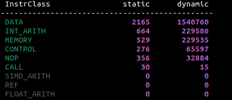

# Instruction Class Monitor

In this task, you will implement a Wizard monitor that classifies all executed instructions into predetermined instruction classes. 
You will report the number of static instructions and dynamically observed instructions that fall under each class after a 
Wasm module has executed. Each instruction will belong to at most a single class.

## Output Format for Grading:

### 1. Instruction Class Entries Output:
- Use the helper method `output()` to print the array of instruction class entries **after the completion of the Wasm module execution**.
- The **instruction class entries must be printed in decreasing order of dynamic counts** (i.e., most frequently executed instruction classes first).

## Important Notes:
- The correct order of output (decreasing order of dynamic counts) is critical for grading.
- Ensure that the helper method `output()` is called only after the Wasm module execution completes.
- **Do not invoke any output functions** other than the methods specified above
- **Double-check your output** to guarantee the entries are sorted properly, as improper ordering will result in lost points.

## Sample Output

