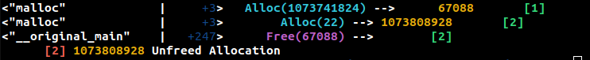

# Malloc Profiling

In this task, you will implement a Wizard monitor to profile memory allocation primitives (i.e. malloc/free), and report these
events to the user during execution.

## Output Format for Grading:

### Allocation Tracking Overview:
Each memory allocation is tracked using a **unique, sequentially incremented id** that starts with 1. This id will be used when invoking the output helper methods as specified below.

### 1. Allocation Record Output:
- Use the helper method `output_alloc_record()` **after** the alloc function completes.
- The argument passed to `output_alloc_record()` **must include the unique id** assigned to the allocation.
- Ensure that the id is **sequentially incremented**, starting from **1**, for each new allocation.

### 2. Free Record Output:
- Use the helper method `output_free_record()` **after** the free function completes.
- The argument passed to `output_free_record()` **must include the id** of the respective allocation call that is being freed.
- If no corresponding allocation call can be mapped, the id should be set to **0**.

### 3. Unfreed Allocation Output:
- After the program execution completes, use the helper method `output_unfreed_alloc_record()` to print all unfreed memory allocations.
- The **unfreed allocations must be printed in ascending order of their allocation id**.

## Important Notes:
- The **correct invocation and order of output** are essential for grading.
- The unfreed allocations **must follow** the specified order based on their allocation id.
- **Do not invoke any other output functions** besides the methods specified above.
- **Double-check your output** to ensure it meets the required format, as incorrect output will result in lost points.
- Make sure to escape the monitor args when invoking from CLI (otherwise bash will expand the curly braces)
  - E.g: `./bin/wizeng '--monitors=malloc{a=malloc,f=free}' ...`

## Sample Output

