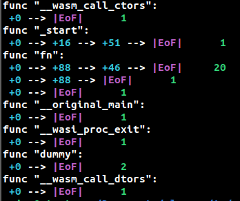

# Path Profiling

In this task, you will implement a Wizard monitor to detect all unique paths executed in functions across the program, and report the number
of times each of them were executed.

A path will consist of an ordered list of program counters. These program counters represent the target of any instruction that may
change the control flow of the program (i.e branches, if/else, loop).

To disallow arbitrarily long paths, paths are terminated when returning from a function and at the `loop` bytecode.

Entering a function is always the first entry in a path, represented by `pc=0`. As a result, every execution of a function
will generate at least one path.

## Output Format for Grading:

### 1. Function Header Output:
- Use the helper method `output_func_header()` to print the header for each function.
- The **function headers must be printed in increasing order of function index** (e.g., Func0, Func1, Func2, ...).
- This method should be invoked before printing any paths for the function.

### 2. Path Output:
- Use the helper method `output_path()` to print each path as a list of PathEntries, representing the order in which the paths were visited.
- After the execution has completed, the **paths for each function must be printed in decreasing order of their length** (i.e., longest path first).

## Post-Execution Output:
- After the program execution completes, ensure that **each function's information is printed in increasing order of function index**.
- After printing each function header, **all paths associated with that function must be output in decreasing order of their path length**.

## Important Notes:
- The **correct order of function headers and paths** is essential for grading.
- The paths **must be ordered from longest to shortest** for each function.
- Do not report unvisited functions or paths.
- Remember that returning from a function and the 'loop' bytecode terminate the path. Entering a new function initiates a new path.
- **Do not invoke any other output functions** besides the methods specified above.
- **Double-check your output** to ensure it meets the required format, as incorrect output will result in lost points.

## Sample output

